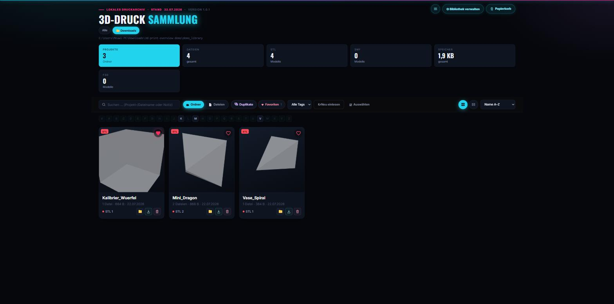
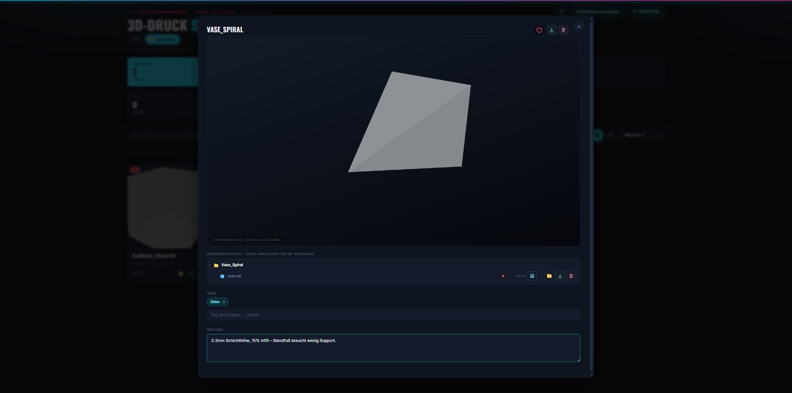
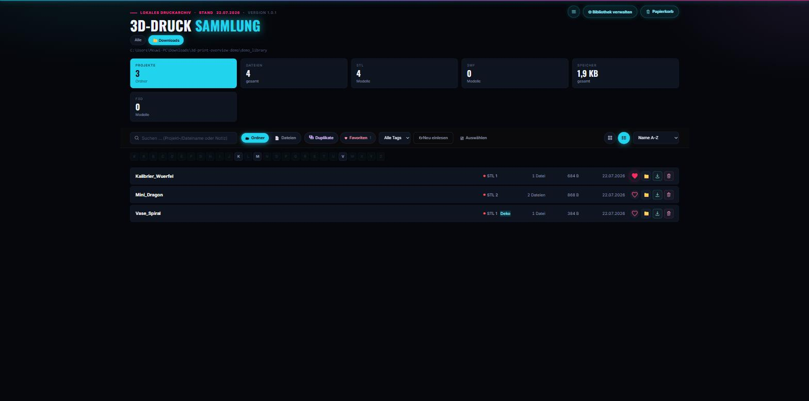

# 3D-Druck-Übersicht

Kleine lokale Web-App, die deinen `Downloads`-Ordner nach `.stl`- und `.3mf`-Dateien
durchsucht und übersichtlich als Galerie darstellt. Dateien, die in einem
gemeinsamen Unterordner liegen (z. B. `Modellname_stls/`), werden automatisch als
ein Projekt gruppiert – ebenso eine lose `.3mf`-Datei, die offensichtlich zum
gleichen Modell wie ein `_stls`-Ordner gehört.

## Screenshots

*(Beispieldaten – zeigt nicht die echte Sammlung eines Nutzers)*

**Galerie-Übersicht** mit Projekt-Gruppierung, Speicher-/Dateistatistik, Favoriten,
Duplikat-Erkennung und Suche/Sortierung:



**3D-Live-Vorschau** direkt im Browser (Drehen/Zoomen per Maus) inklusive Tags
und Notizen pro Projekt:



**Listenansicht** als kompakte Alternative zur Kachel-Galerie:



## Funktionen

- Durchsucht mehrere frei wählbare Ordner nach 3D-Druck-Dateien (`.stl`, `.3mf`,
  `.f3d` u. a. – Dateitypen sind individuell konfigurierbar).
- Gruppiert zusammengehörige Dateien automatisch zu Projekten.
- Zeigt Vorschaubilder: eingebettetes Slicer-Bild, vorhandenes Foto/Render oder
  eine live im Browser gerenderte 3D-Vorschau der `.stl`-Geometrie.
- Favoriten, Tags und Notizen pro Projekt oder Datei.
- Duplikat-Erkennung für Dateien, die mehrfach in der Sammlung liegen.
- Papierkorb mit Wiederherstellen-Option statt sofortigem, endgültigem Löschen.
- Such-, Sortier- und Filterfunktionen (Favoriten, Duplikate, Dateityp, Tags).
- Kachel- und Listenansicht, Ordner- oder flache Dateiansicht.
- Automatische Sicherung von Favoriten, Notizen und Bibliothekseinstellungen.
- Hell/Dunkel/System-Farbschema.
- Als eigenständige Windows-`.exe` mit automatischer Update-Prüfung nutzbar
  (siehe unten).

Vorschaubilder werden so ermittelt:

1. Eingebettetes Vorschaubild aus der `.3mf`-Datei (Bambu Studio / PrusaSlicer).
2. Ein vorhandenes Foto/Render im Projektordner (z. B. `images/`-Unterordner,
   typisch bei Thingiverse-Downloads).
3. Live-Rendering der `.stl`-Geometrie direkt im Browser (three.js), sobald die
   Karte sichtbar wird. Sehr große Dateien (> 45 MB) werden dabei übersprungen,
   um den Browser nicht zu überlasten.

Keine Installation nötig – die App braucht nur Python (Standardbibliothek).

## Starten (Windows)

PowerShell öffnen, dann:

```
cd C:\Users\Meuwi-PC\Downloads\3d-print-overview
python app.py
```

Standardmäßig wird `~/Downloads` durchsucht, also dein echter Downloads-Ordner.
Ein anderer Ordner geht so:

```
python app.py "C:\pfad\zu\anderem\ordner"
```

Danach im Browser öffnen: **http://localhost:8743**

Mit „↻ Neu einlesen" oben rechts wird der Ordner erneut gescannt (z. B. nach
neuen Downloads). Suche, Sortierung und Filter (nur 3MF / nur STL) helfen bei
größeren Sammlungen.

## Beenden

Im PowerShell-Fenster `Strg+C` drücken.

## Als eigenständiges Programm (.exe)

Statt `python app.py` gibt es auch eine Variante als richtiges
Windows-Programm mit eigenem Fenster (kein Browser-Tab, kein sichtbares
Python nötig):

1. `build_exe.bat` doppelklicken (baut einmalig `dist\3D-Druck-Sammlung.exe`).
2. Diese `.exe` an einen beliebigen Ort verschieben und starten.

Das Programm prüft beim Start automatisch, ob eine neuere Version verfügbar
ist (siehe Menü → "Nach Updates suchen"). Die einmalige Einrichtung dieses
Update-Systems ist in **`UPDATE_SETUP.md`** beschrieben.
